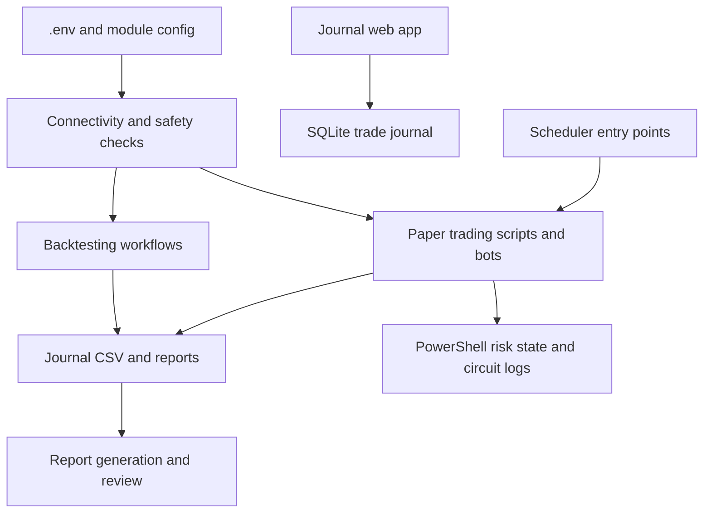

<!-- markdownlint-disable MD013 -->

# Trading Repository

Mixed Python and PowerShell trading tooling for Alpaca paper trading, strategy backtesting, journaling, scheduling, and trading workflow learning.

> [!WARNING]
> This repository is for education and paper-trading workflow development. It is not financial advice, and it should not be treated as production live-trading software without additional controls.

## What The Project Does Today

This repository already supports six main workflows:

1. Alpaca paper-trading helpers in Python and PowerShell under `Alpaca/`
2. Strategy research and replay under `Backtesting/`
3. A browser-based trade journal and CSV/HTML reporting under `Journal/`
4. Windows and shell scheduling entry points under `Scheduler/`
5. A standalone RSI plus MACD bot under `rsi_macd_bot/`
6. A FastAPI webhook executor for BTC signals under `btc-signal-executor/`

The repo also includes a modular PowerShell Alpaca client under `src/`, example PowerShell scripts under `examples/`, Python strategy tests, and PowerShell module tests under `Tests/`.

## Repo Guides

- [Repository Audit](docs/repo-audit.md)
- [Applied Upgrades](upgrades/upgrades.md)
- [Core Trading Foundation Spec](specs/001-core-trading-foundation/spec.md)
- [Backtesting Guide](Backtesting/README.md)
- [Journal Guide](Journal/README.md)
- [Scheduler Guide](Scheduler/README.md)
- [Learning Roadmap](Learning%20Roadmap/README.md)
- [RSI Plus MACD Bot Guide](rsi_macd_bot/README.md)
- [BTC Signal Executor Guide](btc-signal-executor/README.md)
- [Tests Guide](Tests/README.md)

## Recommended Tutorials

### Tutorial 1: First Safe Walkthrough

1. Read the [Learning Roadmap](Learning%20Roadmap/README.md).
2. Complete the root setup steps in this file.
3. Run `python .\Backtesting\backtest.py`.
4. Open the [Journal Guide](Journal/README.md) and run the journal app.
5. Run the [Tests Guide](Tests/README.md) Python checks.

### Tutorial 2: Strategy To Review Loop

1. Use the [Backtesting Guide](Backtesting/README.md) to run one strategy backtest.
2. Review generated trade output in [Journal](Journal/README.md).
3. Use the [Scheduler Guide](Scheduler/README.md) only after the manual flow works.

### Tutorial 3: Advanced Automation Paths

1. Read [RSI Plus MACD Bot Guide](rsi_macd_bot/README.md) for a scheduled bot loop.
2. Read [BTC Signal Executor Guide](btc-signal-executor/README.md) for webhook-based execution.
3. Review [Applied Upgrades](upgrades/upgrades.md) and the active [spec](specs/001-core-trading-foundation/spec.md) before structural repo changes.

## Current Architecture

| Area | Current Role | Main Entry Points |
| --- | --- | --- |
| `src/` | Reusable PowerShell Alpaca modules for config, auth, market data, trading, streams, and risk | `src/Alpaca.*/*.psm1` |
| `Alpaca/` | Python and PowerShell paper-trading scripts and safety helpers | `Alpaca/paper_trade.py`, `Alpaca/alpaca_paper.py`, `Alpaca/alpaca_paper.ps1` |
| `Backtesting/` | Strategy backtests plus live-paper runners | `Backtesting/backtest.py`, `Backtesting/strategies/*.py` |
| `Journal/` | Flask journal app, SQLite and CSV storage, report generation | `Journal/journal_server.py`, `Journal/analyze_journal.py` |
| `Scheduler/` | OS-friendly launchers for scheduled runs | `Scheduler/run_strategy.ps1`, `Scheduler/run_strategy.sh` |
| `rsi_macd_bot/` | Self-contained Alpaca paper bot with logging and risk config | `rsi_macd_bot/bot.py` |
| `btc-signal-executor/` | FastAPI webhook executor for TradingView-style BTC signals | `btc-signal-executor/main.py` |
| `Tests/` | Python `pytest` suite plus PowerShell Pester coverage | `Tests/test_*.py`, `Tests/*.Tests.ps1` |

High-level operating flow:



## Setup

### Prerequisites

- Python 3.13 recommended
- PowerShell 7 recommended for module and automation workflows
- An Alpaca paper account if you want connectivity or paper-trading runs

### Environment Setup

```powershell
python -m venv .venv
.\.venv\Scripts\Activate.ps1
python -m pip install --upgrade pip
python -m pip install -r requirements.txt
Copy-Item .env.example .env
```

Populate `.env` with Alpaca paper credentials before running connectivity or paper-trading commands.

## Usage

### Run the baseline backtester

```powershell
python .\Backtesting\backtest.py
```

### Run the journal app

```powershell
python .\Journal\journal_server.py
```

Then open `http://localhost:5000`.

### Run paper trading helpers

```powershell
python .\Alpaca\paper_trade.py
pwsh -NoProfile -File .\Alpaca\alpaca_paper.ps1
```

### Run the Python test suite

```powershell
.\.venv\Scripts\python.exe -m pytest .\Tests -q
```

### Run PowerShell module checks manually

```powershell
pwsh -NoProfile -Command "Get-ChildItem .\src -Recurse -Filter *.psd1 | ForEach-Object { Test-ModuleManifest $_.FullName | Out-Null }"
```

## Development Workflow

Future repository work should follow the retrofit GitHub Spec process now included in this repo:

1. Capture the change in `specs/<NNN-name>/requirements.md`
2. Convert requirements into implementation detail in `spec.md`
3. Create an execution plan in `plan.md`
4. Break the work into discrete tasks in `tasks.md`
5. Implement with the spec open and update docs/tests alongside code
6. Run an audit against the completed change
7. Run regression checks before merge

For the existing repo baseline:

- Python verification is currently stable in `.venv` with `pytest`
- PowerShell module smoke checks are stable
- PowerShell Pester coverage exists, but the suite currently spans mixed Pester-era syntax and should be modernized in a dedicated follow-up before being made a strict CI gate

## GitHub Spec Workflow

This repository now includes:

- `.github/copilot-instructions.md` for repo-specific implementation guidance
- `.github/prompts/` for reusable requirements, spec, plan, task, audit, regression, and release prompts
- `specs/001-core-trading-foundation/` as the baseline spec retrofit for the current repository state
- `docs/repo-audit.md` as the current repository audit snapshot
- `upgrades/upgrades.md` as the applied-upgrades log for repo-level improvements

When adding a new feature, create the next numbered folder under `specs/` and keep the change grounded in the current architecture rather than reimagining the project.

## Repository Structure

```text
Trading/
|-- .github/
|   |-- copilot-instructions.md
|   |-- prompts/
|   `-- workflows/
|-- docs/
|   |-- repo-audit.md
|   `-- screenshots/
|-- specs/
|   `-- 001-core-trading-foundation/
|-- src/
|-- Alpaca/
|-- Backtesting/
|-- Journal/
|-- Scheduler/
|-- rsi_macd_bot/
|-- btc-signal-executor/
|-- examples/
|-- Tests/
|-- .env.example
|-- .gitignore
|-- pytest.ini
|-- README.md
`-- requirements.txt
```

## Current Quality Notes

- The repo has strong functional coverage across Python workflows and good module decomposition in `src/`.
- The top-level structure is broader than a typical single-application repo, so new work should clearly state which module it affects.
- `Tests/` is capitalized and contains both Python and PowerShell tests. `pytest.ini` now codifies that path to avoid tool drift.
- Existing generated artifacts such as `Journal/report.html` and `Journal/trades.db` remain preserved in this retrofit. They were not deleted or rewritten.

## Baseline Verification

Verified during this retrofit:

- `python -m compileall Alpaca Backtesting Journal rsi_macd_bot btc-signal-executor`
- `.\.venv\Scripts\python.exe -m pytest .\Tests -q`

Observed but not changed in this pass:

- PowerShell Pester tests are present, but the local environment exposed both legacy Pester compatibility issues and some failing assertions. That test migration is captured as follow-up work in the spec documents rather than folded into this scaffold retrofit.

<!-- markdownlint-enable MD013 -->
