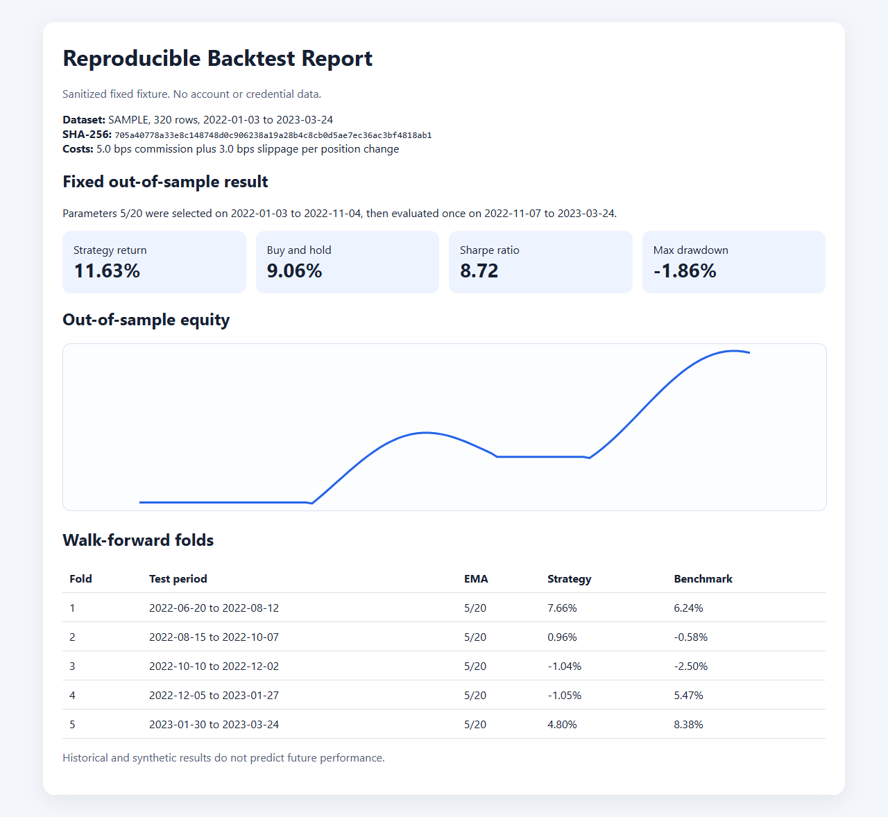
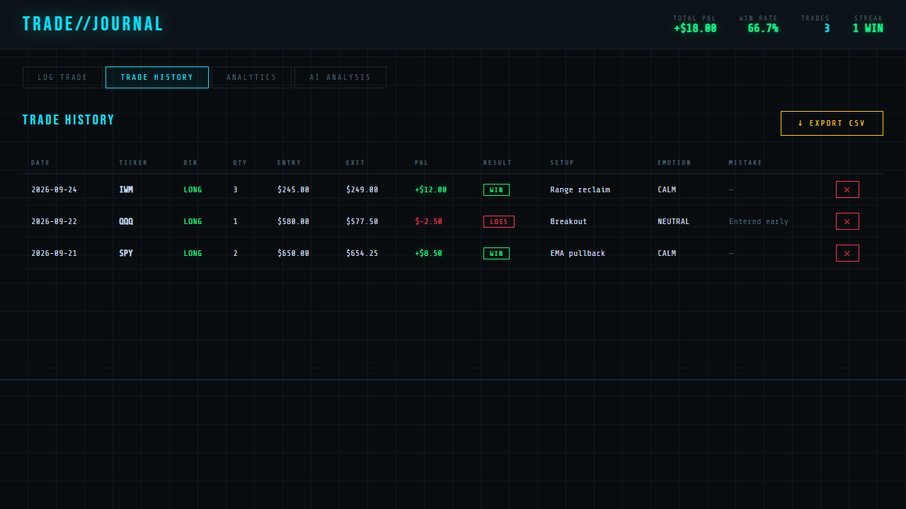
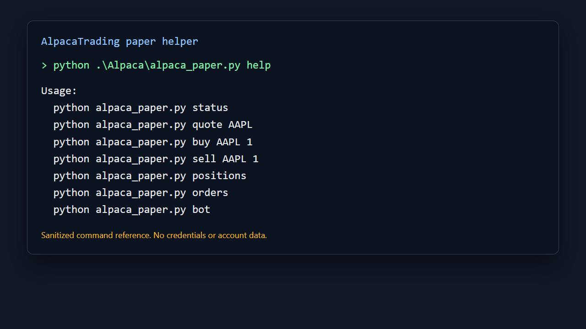

<!-- markdownlint-disable MD013 -->

# AlpacaTrading

[](https://github.com/mickpletcher/AlpacaTrading/actions/workflows/ci.yml)
[](https://github.com/mickpletcher/AlpacaTrading/releases/latest)
[](LICENSE)

AlpacaTrading is a Windows-first learning toolkit for backtesting trading ideas, recording trades, and sending orders to an Alpaca paper account.

Paper trading uses simulated money. This repository cannot place live-money orders. It is for education and testing, not financial advice.

> [!CAUTION]
> Some commands submit real orders to an Alpaca paper account. Start with the backtest and journal. Do not schedule a bot until you understand its output, current defects, and stop procedure.

## Start Here

Choose the task you want to perform.

| Goal | Start with | Sends an order? |
| --- | --- | --- |
| Learn the repository safely | This README, then `Learning Roadmap/README.md` | No |
| Test a strategy on old market data | `Backtesting/README.md` | No |
| Record and review trades | `Journal/README.md` | No |
| Check an Alpaca paper account | `Alpaca/` helpers and examples | No, unless an order command is selected |
| Run a strategy against an Alpaca paper account | `Backtesting/README.md` | Yes |
| Run the RSI plus MACD bot | `rsi_macd_bot/README.md` | Yes |
| Receive TradingView BTC webhooks | `btc-signal-executor/README.md` | Yes |
| Schedule a tested paper workflow | `Scheduler/README.md` | Depends on the target script |
| Develop or validate the code | `Tests/README.md` and `PROJECT-STANDARD.md` | No by default |

## Current Status

- Default branch: `main`
- Intended use: research, learning, and Alpaca paper trading
- Live trading: unavailable by design
- Python version used by CI: 3.13
- PowerShell version recommended: 7 or newer
- Current defects and cautions: [ISSUES.md](ISSUES.md)
- Current assessment and test evidence: [docs/repo-audit.md](docs/repo-audit.md)

The RSI plus MACD bot, BTC executor, and journal currently have open defects. Read the linked component guide and [ISSUES.md](ISSUES.md) before using them.

## What It Looks Like

These captures use only the repository's deterministic fixture and synthetic journal records. They contain no credentials, account identifiers, or private trading history.

### Reproducible backtest report



### Local trade journal



### Paper helper commands



## First Safe Setup on Windows 11

Run these commands in PowerShell from the repository root.

### 1. Confirm the required tools

```powershell
python --version
pwsh --version
git --version
```

Python should report version 3.13 when you want the closest match to CI. If `python` is not found, install Python and select the option that adds it to `PATH`.

### 2. Create an isolated Python environment

```powershell
python -m venv .venv
.\.venv\Scripts\Activate.ps1
python -m pip install --upgrade pip
python -m pip install --require-hashes -r .\requirements.lock.txt
```

The virtual environment keeps this project's Python packages separate from other projects.

If PowerShell blocks `Activate.ps1`, you can run the environment's Python directly:

```powershell
.\.venv\Scripts\python.exe -m pytest .\Tests -q
```

### 3. Run the automated checks before adding credentials

```powershell
.\.venv\Scripts\python.exe -m compileall -q Alpaca Backtesting Journal rsi_macd_bot btc-signal-executor Operations Tests
.\.venv\Scripts\python.exe -m pytest .\Tests -q --cov --cov-config=.coveragerc --cov-fail-under=50
.\.venv\Scripts\python.exe -m pip check
```

Credential-dependent connection tests should report as skipped. A skip is expected when no paper credentials are loaded.

### 4. Run the safest first example

```powershell
.\.venv\Scripts\python.exe .\Backtesting\reproducible_backtest.py
```

This verifies a fixed dataset checksum and creates an out-of-sample and walk-forward report without downloading data or placing an order. Open `Backtesting/output/evaluation-report.html`.

### 5. Open the local journal

```powershell
.\.venv\Scripts\python.exe .\Journal\journal_server.py
```

Open `http://127.0.0.1:5000` in your browser. Keep the journal on the local machine.

### 6. Add paper credentials only when needed

```powershell
Copy-Item .\.env.example .\.env
notepad .\.env
```

Replace only the placeholder values. Never commit `.env`. Confirm the URL remains:

```dotenv
ALPACA_BASE_URL=https://paper-api.alpaca.markets
PAPER=true
```

## What Each Area Does

| Folder | Plain-language purpose |
| --- | --- |
| `Alpaca/` | Direct paper-account helpers and the shared Python paper-only safety boundary |
| `Backtesting/` | Historical strategy tests and paper execution runners |
| `Operations/` | Read-only local health checks and generated health reports |
| `Journal/` | Local browser journal, SQLite data, CSV exchange, and reports |
| `Scheduler/` | Windows and shell launchers for an already tested workflow |
| `rsi_macd_bot/` | Automated stock scanner and paper-order bot |
| `btc-signal-executor/` | FastAPI service that converts authenticated TradingView signals into paper orders |
| `src/` | Reusable PowerShell modules for Alpaca configuration, data, orders, positions, streams, and risk |
| `examples/` | Small PowerShell examples for the reusable modules |
| `Tests/` | Python and PowerShell automated checks |
| `specs/` | Numbered packages describing non-trivial repository changes |

The folders are separate tools. The repository is not one installable application.

## Essential Terms

| Term | Meaning |
| --- | --- |
| Paper trading | Simulated trading through Alpaca. No live money is used. |
| Backtest | A replay of strategy rules against historical data. It cannot prove future profit. |
| Strategy | A set of rules that decides when to buy, sell, or do nothing. |
| Signal | A strategy result such as buy, sell, or close. |
| Order | A request sent to Alpaca to buy or sell an asset. |
| Position | An asset quantity currently held in the paper account. |
| Stop order | An order intended to reduce a position after price reaches a specified level. |
| Webhook | An HTTP request sent by another service, such as TradingView. |
| Circuit breaker | A control that temporarily blocks new activity after configured failures or losses. |
| SQLite | A local database stored in one file. The journal and webhook replay guard use it. |
| `.env` file | A local configuration file for secrets and settings. Git ignores it. |

## Safety Rules

1. Use only Alpaca paper credentials.
2. Never commit `.env`, API keys, passphrases, account identifiers, databases, logs, or journal exports.
3. Run a workflow manually before scheduling it.
4. Confirm open orders and positions in Alpaca after every test involving execution.
5. Stop the process and disable its schedule before troubleshooting unexpected orders.
6. Do not treat a successful backtest as evidence that a strategy will make money.
7. Read [ISSUES.md](ISSUES.md) before running an automated order path.

## Common First-Run Problems

| Problem | What it means | What to do |
| --- | --- | --- |
| `python` is not recognized | Python is missing from `PATH` | Install Python 3.13 or use its full executable path |
| PowerShell blocks activation | Script execution policy prevented `Activate.ps1` | Use `.venv\Scripts\python.exe` directly |
| Missing Alpaca key or secret | The workflow needs paper credentials | Create `.env` from `.env.example` and add paper keys |
| Three tests are skipped | Paper credentials are intentionally absent | This is expected for the default local test run |
| Backtest has no trades | No signal occurred in that symbol and date range | Try a wider range or another liquid symbol |
| Journal opens with no trades | The database is new or CSV data was not imported | Add a sample trade or follow the explicit CSV import instructions |

## Documentation Map

- [Learning roadmap](Learning%20Roadmap/README.md)
- [Backtesting guide](Backtesting/README.md)
- [Journal guide](Journal/README.md)
- [Scheduler guide](Scheduler/README.md)
- [RSI plus MACD bot guide](rsi_macd_bot/README.md)
- [BTC signal executor guide](btc-signal-executor/README.md)
- [Testing guide](Tests/README.md)
- [Operations and recovery](OPERATIONS.md)
- [Security policy and vulnerability reporting](SECURITY.md)
- [Architecture](ARCHITECTURE.md)
- [Current assessment](docs/repo-audit.md)
- [Current defects](ISSUES.md)
- [Technical debt](TECH-DEBT.md)
- [Future upgrades](FUTURE-UPGRADES.md)
- [Development rules](PROJECT-STANDARD.md)

## Development Workflow

Non-trivial changes use a numbered folder under `specs/` containing requirements, a technical specification, a plan, and tasks. Runtime changes must update tests and the affected living documentation. See [PROJECT-STANDARD.md](PROJECT-STANDARD.md) for the complete rules.

Install from `requirements.lock.txt`. When a direct requirement changes, regenerate and verify the lock:

```powershell
pwsh -NoProfile -File .\scripts\Update-PythonLock.ps1
```

Run the complete release validation before creating a release:

```powershell
pwsh -NoProfile -File .\scripts\Invoke-ReleaseValidation.ps1
```

## Known Limitations

- Live trading is intentionally unavailable.
- The reproducible evaluator uses a deterministic synthetic fixture. A real evaluation must use a reviewed fixed dataset with its checksum recorded in the configuration.
- Health and alerting are local. There is no centralized remote monitoring service.
- Releases snapshot the repository but do not package the separate tools into one application.
- Current verified defects are tracked in [ISSUES.md](ISSUES.md).

<!-- markdownlint-enable MD013 -->
